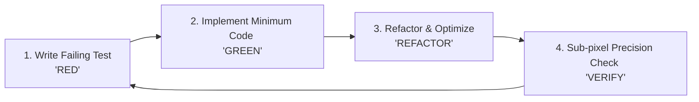

# AOI Test-Driven Development (TDD) Workflow

This skill defines the mandatory TDD engineering practice for developing and refactoring the AOI system.

## Core Principle: Red-Green-Refactor

No production algorithm or core domain logic is written without a prior failing test.



## Step-by-Step TDD Protocol

### Step 1: Define Test Case (RED)
1. Determine the expected mathematical behavior or business requirement.
2. If porting from C#:
   - Locate the legacy logic in `AoiMeasureTool/` (e.g. `ReferenceCornerDetectionService.cs` or `MainForm.Measurement.cs`).
   - Extract expected inputs and output values (e.g., rotation angle = 12.5 deg, distance = 4.521 mm).
3. Create a test file in `tests/` (e.g. `tests/test_corner_detection.py`).
4. Write test with synthetic geometric patterns or real golden sample frames.
5. Run `pytest tests/test_target.py` -> Must FAIL (RED).

### Step 2: Implement Minimal Working Code (GREEN)
1. Implement the minimal logic in `aoi_system/` to make the test pass.
2. Run `pytest tests/test_target.py` -> Must PASS (GREEN).

### Step 3: Refactor & GPU Optimization (REFACTOR)
1. Clean up code structure, add strict Python 3.12 type hints.
2. Add GPU accelerated path (CuPy / OpenCV-CUDA) while ensuring CPU fallback remains functional.
3. Re-run tests -> Must PASS on both CPU and GPU backends.

### Step 4: Industrial Precision Tolerance Standard
- Distance tolerance: `abs(actual - expected) <= 0.001 mm` (1 μm).
- Angle tolerance: `abs(actual_deg - expected_deg) <= 0.05 degree`.
- Judgement rules: 100% categorical match (`A`, `B`, `NG`).

## Running Tests Locally

```powershell
# Run all unit tests with coverage
uv run pytest tests/ -v --cov=aoi_system

# Run specific algorithm test
uv run pytest tests/test_algorithms/ -k "corner" -v
```
